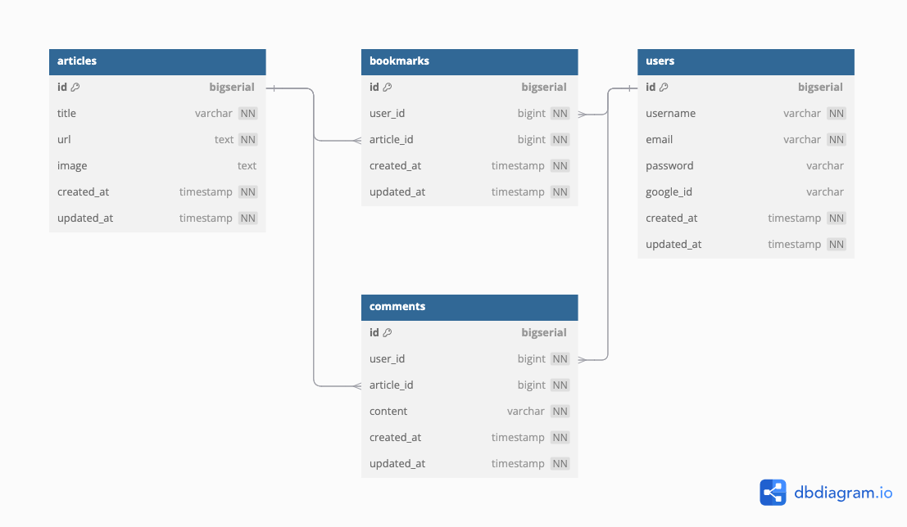

# techbranch-backend

## 使用技術

<p>


</p>

## ローカルでの起動方法

### .env ファイルの作成

.env.sample ファイルから.env ファイルを作成し、Google 認証のキーなどを設定する。

```bash:
$ cp .env.sample .env
```

### Docker イメージの作成と起動

```bash:
$ docker-compose build
$ docker-compose up
```

http://localhost:8080/docs にアクセスできます。

## API ドキュメント

API の詳細なドキュメントは、http://localhost:8080/docs から確認できます。

| メソッド | URL                                               | 概要                                           |
| -------- | ------------------------------------------------- | ---------------------------------------------- |
| GET      | /v1/articles                                      | 記事一覧を取得                                 |
| POST     | /v1/articles                                      | 記事情報の作成                                 |
| PUT      | /v1/articles                                      | 記事情報の更新                                 |
| GET      | /v1/articles/counts                               | 記事数を取得                                   |
| GET      | /v1/articles/{id}                                 | 特定の記事情報を取得                           |
| DELETE   | /v1/articles/{id}                                 | 特定の記事情報を削除                           |
| GET      | /v1/users/{userId}/bookmarks/articles             | 特定ユーザのブックマークした記事一覧を取得     |
| GET      | /v1/oauth/google/callback                         | Google 認証を実行                              |
| GET      | /v1/oauth/google/login                            | Google 認証の URL を取得                       |
| POST     | /v1/refresh-token                                 | リフレッシュトークンからアクセストークンを取得 |
| POST     | /v1/signin                                        | サインインを実行                               |
| GET      | /v1/signin/user                                   | サインインしているユーザ情報を取得             |
| POST     | /v1/signout                                       | サインアウトを実行                             |
| GET      | /v1/signup                                        | サインインを実行                               |
| POST     | /v1/signup                                        | 仮登録を実行                                   |
| GET      | /v1/articles/{articleId}/bookmarks                | 特定の記事のブックマーク情報を取得             |
| DELETE   | /v1/articles/{articleId}/bookmarks                | 特定の記事のブックマーク情報を削除             |
| GET      | /v1/articles/{articleId}/bookmarks/count          | 特定の記事のブックマーク数を取得               |
| POST     | /v1/bookmarks                                     | ブックマークを作成                             |
| DELETE   | /v1/users/{userId}/articles/{articleId}/bookmarks | ブックマークを削除                             |
| GET      | /v1/users/{userId}/bookmarks                      | 特定のユーザのブックマークを取得               |
| DELETE   | /v1/users/{userId}/bookmarks                      | 特定のユーザのブックマークを削除               |
| GET      | /v1/articles/{articleId}/comments                 | 特定の記事のコメントを取得                     |
| DELETE   | /v1/articles/{articleId}/comments                 | 特定の記事のコメントを削除                     |
| POST     | /v1/comments                                      | コメントを作成                                 |
| DELETE   | /v1/comments/{id}                                 | ID からコメントを削除                          |
| DELETE   | /v1/users/{userId}/articles/{articleId}/comments  | ユーザ・記事情報からコメントを削除             |
| GET      | /v1/users/{userId}/comments                       | 特定のユーザのコメントを取得                   |
| DELETE   | /v1/users/{userId}/comments                       | 特定のユーザのコメントを削除                   |
| GET      | /v1/users                                         | ユーザ一覧を取得                               |
| POST     | /v1/users                                         | ユーザ情報を作成                               |
| PUT      | /v1/users                                         | ユーザ情報を更新                               |
| GET      | /v1/users/{id}                                    | 特定のユーザ情報を取得                         |
| DELETE   | /v1/users/{id}                                    | 特定のユーザ情報を削除                         |

## ER 図



## コマンド一覧

| コマンド                                      | 処理概要                           |
| --------------------------------------------- | ---------------------------------- |
| make new-migration -name=<migration filename> | マイグレーションファイルを生成     |
| make migrateup                                | 全てのマイグレーションを実行       |
| make migrateup1                               | 1 つのマイグレーションを実行       |
| make migratedown                              | 全てのマイグレーションを戻す       |
| make migratedown1                             | 1 つのマイグレーションを戻す       |
| make protoc                                   | proto ファイルからコードを自動生成 |
| make mockgen                                  | モックを生成                       |
| make test                                     | ユニットテストを実行               |
| make run                                      | プログラムの実行                   |
| make dbdocs                                   | dbdocs のビューを作成              |
| make dbml2sql                                 | DBML ファイルから SQL を生成       |

## 環境変数

| 環境変数                   | 概要                                              |
| -------------------------- | ------------------------------------------------- |
| DB_SOURCE                  | 接続先 DB の URL                                  |
| MIGRATION_URL              | マイグレーションファイルのパス                    |
| HTTP_SERVER_ADDRESS        | HTTP サーバのアドレス                             |
| GRPC_SERVER_ADDRESS        | gRPC サーバのアドレス                             |
| REDIS_ADDRESS              | 接続先 Redis のアドレス                           |
| REDIS_ACCESS_TOKEN_DB      | アクセストークンを保持する DB 番号                |
| REDIS_REFRESH_TOKEN_DB     | リフレッシュトークンを保持する DB 番号            |
| JWT_ISSUER                 | JWT の発行者                                      |
| JWT_SECRET                 | JWT のシークレットキー                            |
| ACCESS_TOKEN_EXPIRES       | アクセストークンの保持期間                        |
| REFRESH_TOKEN_EXPIRES      | リフレッシュトークンの保持期間                    |
| OAUTH_GOOGLE_STATE         | Google 認証に使用する state                       |
| OAUTH_GOOGLE_CLIENT_ID     | Google 認証に使用するクライアント ID              |
| OAUTH_GOOGLE_CLIENT_SECRET | Google 認証に使用するクライアントシークレット     |
| OAUTH_GOOGLE_REDIRECT_URL  | Google 認証時のリダイレクト URL                   |
| GMAIL_FROM                 | 仮登録メール送信用の Gmail の送信元メールアドレス |
| GMAIL_PASSWORD             | 仮登録メール送信用の Gmail のパスワード           |
| REDIS_PRESIGNUP_DB         | 仮登録情報を保持する DB 番号                      |
| PRESIGNUP_EXPIRES          | 仮登録情報の期間                                  |
| PRESIGNUP_MAIL_SUBJECT     | 仮登録メールのタイトル                            |
| PRESIGNUP_MAIL_TEMPLATE    | 仮登録メールのテンプレートファイル                |
| SIGNUP_URL                 | サインアップの URL                                |